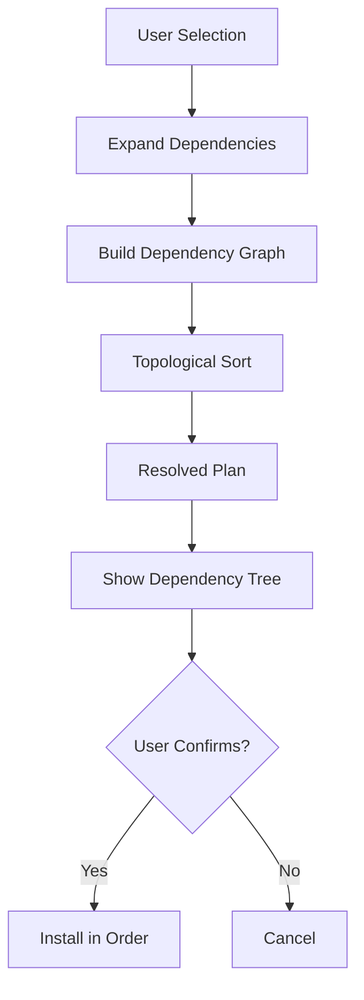

## Overview

Gentle AI follows a **dependency-first approach**: detect what's installed, calculate what's needed, show the full tree, install dependencies before components, then verify.

## Dependency Detection

### System Dependencies

The installer detects these prerequisites:

| Dependency | Min Version | Required | When Needed |
|-----------|-------------|----------|-------------|
| `git` | 2.x | Yes | GGA, Engram git sync, agent integrations |
| `curl` | Any | Yes | Binary downloads, GGA providers |
| `node` | 18.0+ | Yes | Claude Code (18+), Gemini CLI (20+) |
| `npm` | Any | Yes | Installing npm-based agents |
| `brew` | Any | No (macOS) | Preferred package manager on macOS |
| `go` | 1.24+ | No | Only if building Engram from source |

See `/home/daytona/workspace/source/internal/system/deps.go:40`

### Detection Strategy

Dependencies are checked **concurrently** for speed:

```go
func DetectDependencies(ctx context.Context, profile PlatformProfile) DependencyReport {
    deps := defineDependencies(profile)
    var wg sync.WaitGroup
    results := make([]Dependency, len(deps))
    
    for i, dep := range deps {
        wg.Add(1)
        go func(idx int, d Dependency) {
            defer wg.Done()
            results[idx] = detectSingleDep(ctx, d)
        }(i, dep)
    }
    
    wg.Wait()
    return buildReport(results)
}
```

See `/home/daytona/workspace/source/internal/system/deps.go:92`

Each dependency check:

1. **Looks for binary** on PATH using `exec.LookPath`
2. **Runs version command** (e.g., `node --version`)
3. **Parses version** using regex to extract semver
4. **Compares** against minimum required version if specified

### Version Parsing

Version extraction handles various formats:

```go
// Handles:
// - "v18.0.0" → "18.0.0"
// - "git version 2.43.0" → "2.43.0"
// - "curl 8.4.0 (x86_64)" → "8.4.0"
// - "go version go1.22.5 darwin/arm64" → "1.22.5"

var versionRegexp = regexp.MustCompile(`(\d+\.\d+(?:\.\d+)?)`)
var goVersionRegexp = regexp.MustCompile(`go(\d+\.\d+(?:\.\d+)?)`)
```

See `/home/daytona/workspace/source/internal/system/deps.go:34`

### Version Comparison

Semantic version comparison:

```go
func versionAtLeast(version, minVersion string) bool {
    vParts := parseVersionParts(version)  // [18, 2, 0]
    mParts := parseVersionParts(minVersion) // [18, 0, 0]
    
    for i := 0; i < 3; i++ {
        if vParts[i] > mParts[i] { return true }
        if vParts[i] < mParts[i] { return false }
    }
    return true // equal
}
```

See `/home/daytona/workspace/source/internal/system/deps.go:189`

## Component Dependencies

### Dependency Graph

Components declare dependencies via the catalog:

```go
var ComponentGraph = map[model.ComponentID][]model.ComponentID{
    "sdd":         {"skills"},  // SDD needs skills framework
    "skills":      {},          // No dependencies
    "engram":      {},
    "gga":         {},
    "mcp":         {},
    "persona":     {},
    "permissions": {},
    "theme":       {},
}
```

This creates a directed acyclic graph (DAG) of component relationships.

### Topological Sort

Dependencies are resolved using topological sorting:

```go
func TopologicalSort(graph map[ComponentID][]ComponentID) ([]ComponentID, error) {
    // Kahn's algorithm:
    // 1. Find nodes with no incoming edges
    // 2. Remove node and its outgoing edges
    // 3. Repeat until graph is empty
    // 4. If graph not empty → cycle detected
}
```

See `/home/daytona/workspace/source/internal/planner/order.go`

This ensures installation order respects dependencies. For example:
- User selects: `["sdd", "engram", "persona"]`
- Resolver expands: `sdd` depends on `skills`
- Sorted order: `["skills", "sdd", "engram", "persona"]`

## Dependency Resolution Flow



### Example Resolution

**User selects**: Claude Code + Full Gentleman preset

**Expanded dependencies**:

```
Components:
  ✓ engram (selected)
  ✓ sdd (selected)
  + skills (added - sdd dependency)
  ✓ mcp (selected)
  ✓ gga (selected)
  ✓ persona (selected)
  ✓ permissions (selected)
  ✓ theme (selected)

System Dependencies:
  ✓ git 2.43.0 (already installed)
  ✓ curl 8.4.0 (already installed)
  ◌ Node.js 20+ (will install)
  ◌ Homebrew (will install)
```

**Installation order** (topologically sorted):

1. Homebrew
2. Node.js 20
3. Skills (no deps)
4. Engram (no deps)
5. SDD (needs skills)
6. MCP (no deps)
7. GGA (no deps)
8. Persona (no deps)
9. Permissions (no deps)
10. Theme (no deps)

## Platform-Specific Dependency Resolution

### macOS

```go
if profile.OS == "darwin" {
    // Homebrew is preferred package manager
    deps = append(deps, Dependency{
        Name: "brew",
        Required: false,
        DetectCmd: []string{"brew", "--version"},
        InstallHint: "Install via: /bin/bash -c \"$(curl -fsSL https://raw.githubusercontent.com/Homebrew/install/HEAD/install.sh)\"",
    })
}
```

See `/home/daytona/workspace/source/internal/system/deps.go:70`

### Linux

**Ubuntu/Debian**:
- Package manager: `apt`
- Node.js: Installed via NodeSource repository (apt default is often outdated)
- Homebrew: Optional fallback

**Arch/Manjaro**:
- Package manager: `pacman`
- Node.js: Installed via official Arch repos (up-to-date)
- Homebrew: Optional

**Distro detection**:

```go
func detectLinuxDistro(osRelease string) string {
    // Parse /etc/os-release
    // Check ID and ID_LIKE fields
    // Support derivatives: Pop!_OS, Linux Mint, EndeavourOS, etc.
}
```

See `/home/daytona/workspace/source/internal/system/detect.go:157`

### Windows

- Package manager: `winget` (pre-installed on Windows 10/11)
- `npm` global prefix is user-writable by default (no sudo needed)
- `curl` pre-installed on Windows 10+

```go
if runtime.GOOS == "windows" {
    result.System.Profile.NpmWritable = true
}
```

See `/home/daytona/workspace/source/internal/system/detect.go:57`

## Node.js Version Management

Node.js is the most critical dependency. Multiple agents require it:

- **Claude Code**: Requires Node.js 18+
- **Gemini CLI**: Requires Node.js 20+

**Strategy**: Install highest required version (20+) to satisfy all agents.

### Detection of Version Managers

The installer detects if npm's global prefix is user-writable:

```go
func detectNpmWritable(homeDir string) bool {
    out, err := exec.Command("npm", "config", "get", "prefix").Output()
    if err != nil {
        return false
    }
    prefix := strings.TrimSpace(string(out))
    return strings.HasPrefix(prefix, homeDir)
}
```

See `/home/daytona/workspace/source/internal/system/detect.go:69`

If prefix is under `~/.nvm`, `~/.fnm`, or `~/.volta`, the user has a version manager and sudo is not needed.

### Install Hints

Platform-specific installation guidance:

```go
func installHintNode(profile PlatformProfile) string {
    switch profile.PackageManager {
    case "brew":
        return "brew install node@20"
    case "apt":
        return "curl -fsSL https://deb.nodesource.com/setup_20.x | sudo -E bash - && sudo apt-get install -y nodejs"
    case "pacman":
        return "sudo pacman -S nodejs npm"
    case "winget":
        return "winget install OpenJS.NodeJS.LTS"
    default:
        return "Install Node.js 20+ from https://nodejs.org"
    }
}
```

See `/home/daytona/workspace/source/internal/system/install_deps.go`

## Dependency Tree Display

Before installation, the TUI shows a complete dependency tree:

```
┌──────────────────────────────────────────────────────────────────┐
│  DEPENDENCY TREE                                                 │
│                                                                  │
│  Base tools:                                                     │
│    ✓ git (already installed: 2.43.0)                             │
│    ✓ curl (already installed)                                    │
│    ◌ Homebrew (will install)                                     │
│                                                                  │
│  Runtimes:                                                       │
│    ◌ Node.js 20 (needed by: Claude Code, Gemini CLI)            │
│                                                                  │
│  AI Agents:                                                      │
│    ◌ Claude Code (via npm)                                       │
│                                                                  │
│  Ecosystem:                                                      │
│    ◌ Engram (via Homebrew)                                       │
│    ◌ GGA (via Homebrew)                                          │
│    ◌ SDD skills (file copy)                                      │
│    ◌ Skills library (file copy)                                 │
└──────────────────────────────────────────────────────────────────┘
```

Symbols:
- `✓` Already installed
- `◌` Will be installed
- `✗` Missing (with install hint)

## Dependency Installation

After user confirmation, dependencies install via platform commands:

```go
type InstallCommandResolver interface {
    ResolveComponentInstall(profile PlatformProfile, component ComponentID) ([][]string, error)
}
```

Example for Engram on macOS:

```go
commands := [][]string{
    {"brew", "tap", "gentleman-programming/homebrew-tap"},
    {"brew", "install", "engram"},
}
```

Example for Engram on Ubuntu:

```go
commands := [][]string{
    {"curl", "-fsSL", "-o", "/tmp/engram", "https://github.com/.../engram_linux_amd64"},
    {"chmod", "+x", "/tmp/engram"},
    {"sudo", "mv", "/tmp/engram", "/usr/local/bin/engram"},
}
```

See `/home/daytona/workspace/source/internal/installcmd/resolver.go`

## Verification

After installation, dependencies are re-checked:

```go
func VerifyDependency(dep Dependency) (bool, error) {
    // Re-run detection
    // Check version if required
    // Return success/failure
}
```

If verification fails:
- Show clear error message
- Provide manual installation instructions
- Offer to retry

## Common Scenarios

<CardGroup cols={2}>
  <Card title="Fresh Machine" icon="laptop">
    User has nothing installed. Installer detects missing deps, shows full tree, installs everything in order: Homebrew → Node.js → agents → ecosystem.
  </Card>
  
  <Card title="Partial Setup" icon="puzzle-piece">
    User has git and Node.js but not Homebrew. Installer skips what exists, installs only missing pieces.
  </Card>
  
  <Card title="Multiple Agents" icon="users">
    User selects Claude Code + Gemini CLI. Both need Node.js 20+. Installer installs Node.js once, configures both agents.
  </Card>
  
  <Card title="Outdated Version" icon="arrow-rotate-right">
    User has Node.js 16 but needs 20+. Installer detects version mismatch, offers to install 20+ via version manager.
  </Card>
</CardGroup>

## Troubleshooting

See [Troubleshooting Guide](/advanced/troubleshooting) for dependency-related issues.
