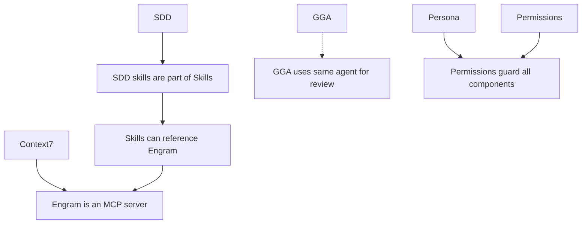

## Overview

The Gentleman AI ecosystem consists of **8 core components** that work together to create a championship-level AI development environment. Each component serves a specific purpose and integrates seamlessly with the others.

<CardGroup cols={2}>
  <Card title="Engram" icon="brain" color="#B7CC85">
    Persistent cross-session memory
  </Card>
  <Card title="SDD" icon="clipboard-list" color="#7FB4CA">
    Spec-Driven Development workflow
  </Card>
  <Card title="Skills" icon="book-open" color="#E0C15A">
    Curated coding skill library
  </Card>
  <Card title="Context7" icon="globe" color="#957FB8">
    Latest framework and library docs
  </Card>
  <Card title="Persona" icon="user-tie" color="#CB7C94">
    Gentleman, neutral, or custom behavior
  </Card>
  <Card title="Permissions" icon="shield-check" color="#FF9E64">
    Security-first defaults and guardrails
  </Card>
  <Card title="GGA" icon="shield-halved" color="#73DACA">
    AI-powered code review on every commit
  </Card>
  <Card title="Theme" icon="palette" color="#DCA561">
    Gentleman Kanagawa theme overlay
  </Card>
</CardGroup>

## Component Details

### Engram — Persistent Memory

<Accordion title="What is Engram?">
  **Persistent cross-session memory system** that remembers context across development sessions.
  
  **The Problem It Solves**: AI agents have no memory. Every new session starts from scratch. You repeat the same explanations, re-establish the same conventions, and lose the history of decisions and bug fixes.
  
  **How Engram Works**:
  1. Runs as a local server on `localhost:7437`
  2. Uses SQLite with FTS5 (full-text search) for fast semantic queries
  3. Stores observations, decisions, session summaries, and bug reports
  4. Integrates via MCP server or agent-specific plugins
  
  **What Gets Remembered**:
  - **Decisions**: "Why did we choose JWT over sessions?"
  - **Bugs**: "This happened before in v2.3—here's the fix"
  - **Conventions**: "We always use Zod for API validation"
  - **Session Summaries**: "Last session: added auth middleware to 3 routes"
  
  **Installation**:
  - Binary install via Homebrew: `brew install engram`
  - Direct download from GitHub Releases
  - Go install: `go install github.com/gentleman-programming/engram@latest`
  
  **Agent Integration**:
  - **Claude Code**: Plugin + MCP server
  - **OpenCode**: TypeScript plugin + MCP server
  - **Gemini CLI**: MCP server in settings.json
  - **Cursor**: MCP server in mcp.json
  - **VS Code Copilot**: MCP server in mcp.json
  
  **Storage Location**: `~/.engram/engram.db`
  
  **Auto-start**: Configured during installation for launchd (macOS) or systemd (Linux)
</Accordion>

### SDD — Spec-Driven Development

<Accordion title="What is SDD?">
  **Spec-Driven Development** is a workflow that ensures the agent plans before coding.
  
  **The Problem It Solves**: AI agents tend to jump straight to implementation without understanding requirements, exploring the codebase, or designing the solution. This leads to incorrect implementations, missed edge cases, and technical debt.
  
  **The 9-Phase Workflow**:
  
  | Phase | Purpose | Output |
  |-------|---------|--------|
  | **Init** | Bootstrap SDD context | `.sdd/context.md` |
  | **Explore** | Investigate codebase | `.sdd/delta/exploration-notes.md` |
  | **Propose** | Create change proposal | `.sdd/delta/proposal.md` |
  | **Spec** | Write specifications | `.sdd/delta/spec.md` |
  | **Design** | Technical design | `.sdd/delta/design.md` |
  | **Tasks** | Break down into tasks | `.sdd/delta/tasks.md` |
  | **Apply** | Implement code | Actual code changes |
  | **Verify** | Validate implementation | Test results |
  | **Archive** | Sync and archive | `.sdd/archive/YYYYMMDD-HHMMSS/` |
  
  **Sub-agent Orchestration**:
  
  The SDD orchestrator injected into agent system prompts enables **parallel sub-agent delegation**:
  
  ```
  Main Agent
    ├─ Explore Sub-agent → codebase investigation
    ├─ Spec Sub-agent → requirements gathering
    └─ Design Sub-agent → architecture decisions
  ```
  
  All agents support this natively—no special configuration needed.
  
  **Installation**:
  - 9 skill files copied to agent's skill directory
  - Full orchestrator injected into system prompt
  - Slash commands for OpenCode (`/sdd-init`, `/sdd-new`, etc.)
  
  **Source**: [Gentleman-Programming/sdd-agent-team](https://github.com/Gentleman-Programming/sdd-agent-team)
</Accordion>

### Skills — Curated Coding Patterns

<Accordion title="What are Skills?">
  **Curated coding skill library** that encodes best practices for modern development stacks.
  
  **The Problem It Solves**: AI agents don't know your team's conventions, latest framework patterns, or best practices. They generate generic code that doesn't follow your standards.
  
  **Skill Categories**:
  
  #### SDD Skills (9 skills)
  - `sdd-init` — Bootstrap SDD context
  - `sdd-explore` — Investigate codebase
  - `sdd-propose` — Create change proposals
  - `sdd-spec` — Write specifications
  - `sdd-design` — Technical design
  - `sdd-tasks` — Break down tasks
  - `sdd-apply` — Implement code
  - `sdd-verify` — Validate implementation
  - `sdd-archive` — Archive completed changes
  
  #### Foundation Skills (2 skills)
  - `go-testing` — Go testing patterns including Bubbletea TUI testing
  - `skill-creator` — Create new AI agent skills following the Agent Skills spec
  
  #### Future Skills (planned)
  - `react-19` — React 19 patterns and best practices
  - `nextjs-15` — Next.js 15 App Router patterns
  - `tailwind-4` — Tailwind CSS 4 utility patterns
  - `zustand-5` — Zustand 5 state management
  - `zod-4` — Zod 4 validation schemas
  - `ai-sdk-5` — Vercel AI SDK 5 patterns
  - `playwright` — Playwright testing patterns
  - `pytest` — Python testing with pytest
  - `django-drf` — Django REST Framework patterns
  
  **How Skills Work**:
  1. Skill files are markdown (`.md`) with structured instructions
  2. Copied to each agent's skill directory during installation
  3. Agents auto-detect and load skills based on file context
  4. Skills follow the Agent Skills specification
  
  **Installation**:
  - Skills copied to agent-specific directories:
    - Claude Code: `~/.claude/skills/`
    - OpenCode: `~/.config/opencode/skill/`
    - Cursor: `~/.cursor/skills/`
    - VS Code: `~/.copilot/skills/`
  
  **Agent Instructions**: System prompts are configured to load skills automatically when working with relevant file types.
</Accordion>

### Context7 — Real-Time Documentation

<Accordion title="What is Context7?">
  **MCP server for live framework and library documentation**.
  
  **The Problem It Solves**: AI agents' training data is always outdated. React 19 features? Next.js 15 patterns? Tailwind 4 utilities? The agent doesn't know them unless you paste docs manually.
  
  **How Context7 Works**:
  - MCP (Model Context Protocol) server that fetches real-time docs
  - No authentication required (public documentation)
  - Supports major frameworks: React, Next.js, Tailwind, Vue, Angular, etc.
  - Agent queries Context7 automatically when working with these frameworks
  
  **Example Query Flow**:
  ```
  Developer: "Use React 19 Server Actions for form submission"
  Agent → Context7: Query latest React 19 Server Actions docs
  Context7 → Agent: Current API and patterns
  Agent → Developer: Implementation with latest syntax
  ```
  
  **Installation**:
  - Configured automatically during Gentle AI installation
  - Added to MCP config for all selected agents
  - No API keys or authentication needed
  
  **Configuration**:
  - **Claude Code**: `~/.claude/mcp/context7.json`
  - **OpenCode**: Entry in `opencode.json` mcpServers
  - **Gemini CLI**: Entry in `settings.json` mcpServers
  - **Cursor**: Entry in `mcp.json`
  - **VS Code**: Entry in `Code/User/mcp.json`
</Accordion>

### Persona — Behavior Modes

<Accordion title="What is Persona?">
  **Configurable behavior mode** that defines how your agent communicates and teaches.
  
  **The Problem It Solves**: Default AI agents are helpful but generic. They complete tasks without teaching. They don't push back on bad practices or explain the "why" behind decisions.
  
  **Three Persona Modes**:
  
  #### Gentleman Mode
  
  **"Your own Gentleman!"**
  
  Senior Architect mentor who:
  - **Teaches** — Explains the why, not just the how
  - **Challenges** — Pushes back on bad practices
  - **Guides** — Helps you understand before implementing
  - **Bilingual** — Responds in Rioplatense Spanish for Spanish input, English otherwise
  - **Personality** — Uses Tony Stark/Jarvis analogies
  
  Custom thinking verbs (status messages):
  - "Tomando un Cafecito mientras Pienso" (Having a coffee while thinking)
  - "Revisando el Código como un Gentleman" (Reviewing code like a Gentleman)
  
  #### Neutral Mode
  
  Professional, helpful, no personality overlay.
  - Default agent behavior
  - Facts and solutions without commentary
  - Security permissions still applied
  
  #### Custom Mode
  
  Bring your own persona!
  - Provide custom persona description
  - Future support for community persona presets
  
  **Installation**:
  - Persona injected into agent's system prompt
  - Thinking verbs configured (Claude Code only)
  - Custom statusline with persona indicators
  
  **Files Modified**:
  - **Claude Code**: `CLAUDE.md`, `settings.json`
  - **OpenCode**: `AGENTS.md`, `opencode.json`
  - **Cursor**: `.cursorrules`
  - **Gemini CLI**: `system.md`
  - **VS Code**: `prompts/gentle-ai.instructions.md`
</Accordion>

### Permissions — Security Guardrails

<Accordion title="What are Permissions?">
  **Security-first defaults and guardrails** for agent behavior.
  
  **The Problem It Solves**: AI agents can access sensitive files, run destructive commands, and make risky changes without confirmation. This is a security nightmare.
  
  **Security Rules** (applied regardless of persona):
  
  #### Blocked Actions
  - **Block `.env` access** — Never read or write environment files
  - **Block credentials** — Never access `credentials.json`, API keys, tokens
  - **Block sensitive paths** — No access to SSH keys, auth tokens, etc.
  
  #### Require Confirmation
  - **Destructive git operations** — `git reset --hard`, `git push --force`, etc.
  - **File deletions** — Confirm before deleting files
  - **System commands** — Confirm before running system-level changes
  
  #### Allowed by Default
  - Standard development tools (compilers, package managers, test runners)
  - File read/write in project directories
  - Git operations (commit, push, branch, etc.)
  - Database access (local development only)
  
  **Installation**:
  - Configured in agent settings files
  - Applied automatically with all presets (not optional)
  - Can be customized per-project
  
  **Files Modified**:
  - **Claude Code**: `settings.json` → `permissions` object
  - **OpenCode**: `opencode.json` → `permissions` object
  - **Cursor**: Security rules in `.cursorrules`
  - **Gemini CLI**: Security rules in `system.md`
  - **VS Code**: Workspace settings
</Accordion>

### GGA — Code Review Guardian

<Accordion title="What is GGA?">
  **Gentleman Guardian Angel** — AI-powered code review on every git commit.
  
  **The Problem It Solves**: While skills teach HOW to write code and SDD ensures planning, GGA ensures the code that gets committed actually meets standards—even code you wrote manually.
  
  **How GGA Works**:
  1. Installed as a pre-commit git hook
  2. On `git commit`, reads staged files + `AGENTS.md` rules
  3. Sends code to configured AI provider for review
  4. AI validates code against team standards
  5. Commit allowed (✓ PASSED) or blocked (✗ FAILED)
  6. Smart cache avoids redundant reviews
  
  **Supported AI Providers**:
  
  | Provider | Config | Mechanism |
  |----------|--------|----------|
  | Claude Code | `claude` | Pipes prompt to `claude --print` |
  | Gemini CLI | `gemini` | `gemini -p` CLI |
  | OpenCode | `opencode[:model]` | `opencode run` |
  | Ollama | `ollama:<model>` | REST API or CLI fallback |
  | LM Studio | `lmstudio[:model]` | OpenAI-compatible API |
  | GitHub Models | `github:<model>` | Azure-hosted API |
  
  **Smart Caching**:
  - Two-level cache: metadata + file content (SHA256)
  - Only `PASSED` files are cached
  - Cache invalidation on `AGENTS.md` changes
  - Avoids redundant reviews of unchanged code
  
  **Modes**:
  - **Pre-commit** (default): Reviews staged files before commit
  - **PR mode**: `gga run --pr-mode` reviews all changed files in branch
  - **CI mode**: `gga run --ci` for pipeline integration
  
  **Installation**:
  ```bash
  # Global install (done by gentle-ai)
  brew install gga
  
  # Per-project setup (manual)
  cd your-project
  gga init
  gga install
  ```
  
  **Configuration**:
  - Global config: `~/.config/gga/config`
  - Per-project: `.gga` file in repo root
  - Team standards: `AGENTS.md` (version controlled)
  
  **Example `.gga` config**:
  ```bash
  GGA_PROVIDER=claude
  GGA_TIMEOUT=120
  GGA_CACHE_ENABLED=true
  ```
  
  **Source**: [Gentleman-Programming/gentleman-guardian-angel](https://github.com/Gentleman-Programming/gentleman-guardian-angel)
</Accordion>

### Theme — Visual Polish

<Accordion title="What is Theme?">
  **Gentleman Kanagawa theme overlay** for agent interfaces.
  
  **Status**: Future enhancement (currently planned, not yet implemented)
  
  **Planned Features**:
  - Navy/steel/gold color scheme
  - Custom statusline with context usage
  - Gentleman branding elements
  - Consistent look across all agents
  
  **Color Palette**:
  - Primary: `#1a1b26` (deep navy)
  - Accent: `#E0C15A` (gold)
  - Success: `#B7CC85` (green)
  - Info: `#7FB4CA` (blue)
  - Warning: `#FF9E64` (orange)
  - Error: `#CB7C94` (red)
</Accordion>

## Component Dependencies

Some components depend on others:



## Installation Matrix

What gets installed with each preset:

| Component | Full Gentleman | Ecosystem Only | Minimal | Custom |
|-----------|---------------|----------------|---------|--------|
| Engram | ✓ | ✓ | ✓ | Optional |
| SDD | ✓ | ✓ (P0 skills) | — | Optional |
| Skills | ✓ (all) | ✓ (P0 only) | — | Optional |
| Context7 | ✓ | ✓ | — | Optional |
| Persona | Gentleman | Gentleman | Neutral | Choice |
| Permissions | ✓ | ✓ | ✓ | ✓ (always) |
| GGA | ✓ | ✓ | — | Optional |
| Theme | ✓ (future) | ✓ (future) | — | Optional |

## Next Steps

<CardGroup cols={2}>
  <Card title="Presets" icon="sliders" href="/concepts/presets">
    Choose your configuration level
  </Card>
  
  <Card title="Skills" icon="book" href="/concepts/skills">
    Explore the curated skill library
  </Card>
  
  <Card title="Personas" icon="user-tie" href="/concepts/personas">
    Choose your agent's behavior mode
  </Card>
  
  <Card title="Install Now" icon="download" href="/quickstart">
    Get started with Gentle AI
  </Card>
</CardGroup>