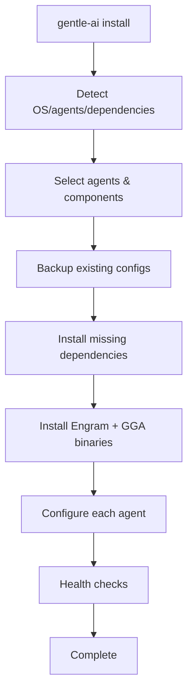
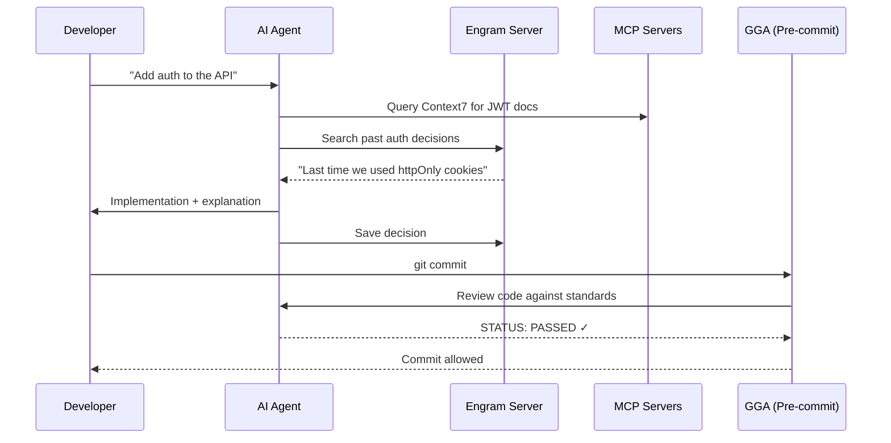

## What is Gentle AI?

Gentle AI is **not an AI agent installer**. Most agents are already easy to install. Gentle AI is an **ecosystem configurator** that takes whatever AI coding agent(s) you use and supercharges them with the Gentleman stack.

<Note>
**The Problem**: Installing an AI agent is easy. Making it actually useful is where everyone fails. A raw AI agent out of the box is like a sports car with no tuning—it runs, but it's nowhere near its potential.
</Note>

## Before and After

<CardGroup cols={2}>
  <Card title="Before Gentle AI" icon="circle-xmark" color="#CB7C94">
    - Agent has no memory between sessions
    - Code written without planning or specifications
    - No access to real-time documentation
    - Basic chatbot behavior that just completes tasks
    - Inconsistent code quality with no review gate
  </Card>
  
  <Card title="After Gentle AI" icon="circle-check" color="#B7CC85">
    - Persistent cross-session memory with Engram
    - Spec-Driven Development workflow (plan before code)
    - MCP servers for live framework docs
    - Teaching-oriented persona that explains the why
    - AI-powered code review on every commit
  </Card>
</CardGroup>

## The Ecosystem Stack

Gentle AI configures **8 core components** into your AI agents:

### Memory Layer: Engram

Persistent cross-session memory that remembers:
- Past decisions and why you made them
- Bug fixes and their root causes
- Project conventions and team standards
- Session summaries and development history

Engram runs as a local server (`localhost:7437`) with SQLite + FTS5 for full-text search. Every agent you configure connects to the same Engram instance, creating a **shared brain** across tools.

### Workflow Layer: SDD

Spec-Driven Development orchestrates **9 phases** to ensure the agent plans before coding:

1. **Init** — Bootstrap SDD context in a project
2. **Explore** — Investigate codebase before committing to a change
3. **Propose** — Create change proposal with intent, scope, approach
4. **Spec** — Write specifications with requirements and scenarios
5. **Design** — Technical design with architecture decisions
6. **Tasks** — Break down into implementation tasks
7. **Apply** — Implement following specs and design
8. **Verify** — Validate implementation matches specs
9. **Archive** — Sync delta specs to main specs and archive

The full SDD orchestrator is injected into every agent's system prompt, enabling sub-agent delegation for parallel workflow execution.

### Skills Library

Curated coding patterns organized by category:
- **SDD skills** (9 skills) — workflow orchestration
- **Foundation skills** (2 skills) — Go testing, skill creation
- **Future skills** — React 19, Next.js 15, Tailwind 4, Zod 4, and more

Skills are written as markdown files in each agent's skill directory, automatically loaded based on file context.

### Knowledge Layer: MCP Servers

**Context7** provides real-time library documentation so the agent always has up-to-date framework information. Additional MCP servers (Notion, Jira) can be configured for project management integration.

### Quality Gate: GGA

**Gentleman Guardian Angel** is a pre-commit git hook that performs AI-powered code review:
- Validates code against team standards defined in `AGENTS.md`
- Uses smart caching (SHA256-based) to avoid redundant reviews
- Supports any AI provider (Claude, Gemini, Ollama, etc.)
- Blocks commits that don't meet standards

While skills teach the agent HOW to write code and SDD ensures the agent PLANS before coding, GGA ensures the code that gets committed actually meets standards—even code you wrote manually.

### Persona Layer

Choose your agent's behavior:
- **Gentleman Mode** — Senior Architect mentor who teaches and challenges
- **Neutral Mode** — Professional, no personality overlay
- **Custom** — Bring your own persona

### Security: Permissions

Security-first defaults regardless of persona:
- Block access to `.env` files
- Require confirmation on destructive git operations
- Allow standard development tools

### Theme Layer

Gentleman Kanagawa theme overlay (future enhancement).

## How Installation Works

The installer follows a **dependency-first approach**:

### Phase 1: Detection

- Detects OS, architecture, WSL, package managers
- Scans for installed AI agents
- Checks existing dependencies (git, Node.js, etc.)
- Identifies existing configurations

### Phase 2: User Selection

- Choose which agents to configure
- Select persona mode
- Pick preset or custom component selection

### Phase 3: Backup

All existing configs are backed up to `~/.gentle-ai-backup-TIMESTAMP/` before any changes.

### Phase 4: Dependencies

- Installs Homebrew (macOS/Linux) if missing
- Installs Node.js 20+ if Claude Code or Gemini CLI selected
- Installs git if missing
- All with clear progress and platform-specific guidance

### Phase 5: Core Components

- Installs Engram binary via Homebrew or direct download
- Installs GGA binary via Homebrew or direct download
- Starts Engram server and configures auto-start

### Phase 6: Agent Configuration

For each selected agent:
1. Inject Engram plugin/MCP/instructions
2. Copy skills to agent's skill directory
3. Configure SDD orchestrator + commands
4. Configure MCP servers (Context7, etc.)
5. Inject persona into system prompt
6. Apply theme + permissions + statusline
7. Configure GGA provider to match agent

### Phase 7: Verification

Health checks:
- Engram: `GET /health` endpoint
- Skills: verify files exist
- MCP: validate config syntax
- GGA: `gga --version`

## Runtime Architecture

After installation, here's what happens during development:

## Cross-Agent Synchronization

When you use multiple agents, the ecosystem keeps them in sync:

- **Engram** is the shared brain—a decision made in Claude Code is available in OpenCode and Gemini CLI
- **Skills** are identical copies in each agent's directory
- **GGA** works with any agent for review execution
- **MCP servers** are configured consistently across agents

<Note>
**Key Principle**: You can switch agents freely without losing context. The ecosystem travels with you.
</Note>

## Supported Platforms

<Tabs>
  <Tab title="macOS">
    **Fully supported** on both Apple Silicon and Intel.
    
    - Package manager: Homebrew
    - All agents supported
    - Native binary releases
  </Tab>
  
  <Tab title="Linux">
    **Fully supported** on Ubuntu/Debian, Arch, and derivatives.
    
    - Package managers: apt, pacman, Homebrew
    - Distro detection via `/etc/os-release`
    - Native binary releases for amd64 and arm64
  </Tab>
  
  <Tab title="Windows">
    **Supported** on Windows 10/11.
    
    - Package manager: winget (pre-installed)
    - PowerShell installer script
    - Native binary releases
    - Note: Some agents use WSL paths
  </Tab>
</Tabs>

## Next Steps

<CardGroup cols={2}>
  <Card title="Install Gentle AI" icon="download" href="/quickstart">
    Get started with the one-command installer
  </Card>
  
  <Card title="Supported Agents" icon="robot" href="/concepts/agents">
    See all supported AI coding agents
  </Card>
  
  <Card title="Components" icon="puzzle-piece" href="/concepts/components">
    Learn about the 8 ecosystem components
  </Card>
  
  <Card title="Skills" icon="book" href="/concepts/skills">
    Explore the curated skill library
  </Card>
</CardGroup>